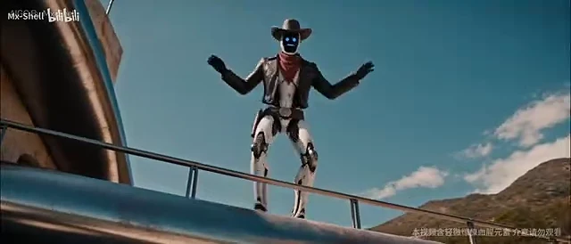
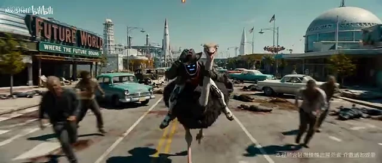
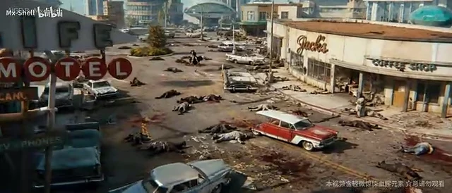
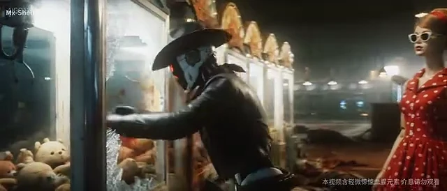
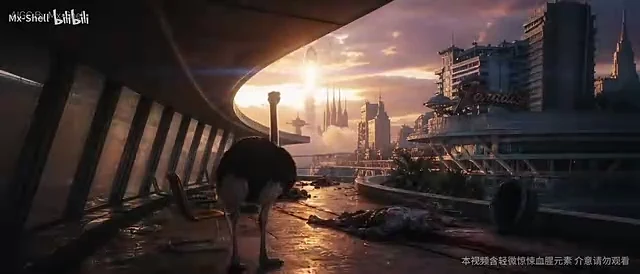

# 《丧尸清道夫》完整文字拉片

> 母片：Mx-Shell 发布的 3 分 34 秒重制版。本文只做镜头语言、叙事和制作方法分析，不提供或转载原片素材。

## 拉片说明

- 官方母片：[AI 原创短片《丧尸清道夫》重制版](https://www.bilibili.com/video/BV1FFRQB2Eqw/)
- 作者：[Mx-Shell](https://space.bilibili.com/388217494)
- 母片时长：`03:33.55`
- 画幅：约 `2.33:1` 的宽银幕
- 时间码误差：约 `±0.2 秒`
- 分析方法：自动场景变化检测 + 每两秒固定抽帧 + 候选切点人工复核

算法检测到 105 个候选画面变化。爆炸、甩镜、拍照闪白和快速动作会产生大量不足半秒的变化，因此本文将连续特效帧合并，并将片名、过渡和片尾作为独立教学节点，最终整理为 **80 个可读镜头单元**。这里的“镜头单元”服务于学习，不等同于作者剪辑工程中的轨道切点。

## 一句话读懂全片

一个拥有像素表情的原子朋克机器人，在末日海滨独自生活。它遇见一只鸵鸟，把战斗变成旅程；后来又遇见一名女子，把荒诞的末日变成爱情；最终二人乘飞船离开地球。全片真正的主题不是“机器人杀丧尸”，而是 **一个非人角色在废墟里逐渐获得陪伴、情感和选择**。

## 整体结构

| 段落 | 时间 | 内容 | 叙事作用 |
|---|---:|---|---|
| 序幕 | 00:00–00:17 | 海滨、女子、机器人、武器、片名 | 先卖世界和角色，不解释剧情 |
| 角色展示 | 00:17–00:35 | 机器人舞蹈蒙太奇 | 建立性格：危险世界里的快乐异类 |
| 遇见鸵鸟 | 00:35–01:02 | 别墅内的误会与表情反应 | 用反应镜头完成无对白喜剧 |
| 公路清扫 | 01:02–01:40 | 报纸、骑行、爆炸、打斗 | 把搭档关系变成动作冒险 |
| 时间与地点转场 | 01:40–02:01 | 1989、西海岸、汽车旅馆 | 扩大世界，给动作段降速 |
| 遇见女子 | 02:01–02:31 | 橱窗、红裙、对视、餐厅 | 从伙伴喜剧转入爱情段落 |
| 爱情蒙太奇 | 02:31–02:55 | 草地、照片、抓娃娃、乘车、理发 | 用物件和场景快速压缩关系发展 |
| 日落与逃亡 | 02:55–03:14 | 日落、丧尸打断、飞船升空 | 让浪漫与危险再次碰撞 |
| 太空尾声 | 03:14–03:34 | 舷窗、地球、两人相伴、片尾 | 用安静留白收束主题 |

## 第一段：序幕与世界建立（00:00–00:17）

<figure class="shot-analysis-frame"><a href="./images/shot-analysis/shots/shot-006.webp" target="_blank"></a><figcaption>序幕代表帧，约 00:14。点击查看原始尺寸。画面来源：Mx-Shell 官方重制版，仅用于本页拉片教学。</figcaption></figure>

| # | 时间码 | 画面、景别与运镜 | 声画与叙事作用 |
|---:|---:|---|---|
| 1 | 00:00–00:03.10 | 贴近泳池地面的低机位，女子双腿和废墟道具形成前景，海岸与泳池延伸到背景。 | 不先给全貌，只给身体和环境碎片；观众先感到奢华、危险和夏日热度。 |
| 2 | 00:03.10–00:05.57 | 逆光中景拍女子背影，太阳从身体边缘溢出，曲线建筑和海平线构成横向层次。 | 把末日拍成度假广告，建立“美丽与破败并存”的第一层反差。 |
| 3 | 00:05.57–00:09.00 | 机器人正面近景举枪，牛仔帽、围巾和蓝色像素脸成为识别锚点。 | 第一时间把主角定义为“牛仔 + 机器人 + 喜剧表情”，避免普通末日英雄。 |
| 4 | 00:09.00–00:11.43 | 武器和机械手插入特写，动作占满画面。 | 用材质和动作建立硬度，为后面的舞蹈与爱情反差做准备。 |
| 5 | 00:11.43–00:14.47 | 片名以红色大字压在海滨画面上。 | 红字延续血、危险和复古类型片气质；片名出现得短，不拖慢开头。 |
| 6 | 00:14.47–00:16.90 | 高空大全景展示流线型滨海别墅、泳池、沙滩和散落尸体。 | 前面给碎片，此处才交代空间全貌；观众理解这里曾是天堂，现在是战场。 |

### 本段可借鉴

先用 **三个感官碎片** 建立世界：身体、武器、建筑；再用大全景回答“这是哪里”。不要一开始就用字幕解释末日背景。

## 第二段：机器人舞蹈蒙太奇（00:17–00:35）

<figure class="shot-analysis-frame"><a href="./images/shot-analysis/shots/shot-014.webp" target="_blank"></a><figcaption>舞蹈段代表帧，约 00:29。点击查看原始尺寸。画面来源：Mx-Shell 官方重制版，仅用于本页拉片教学。</figcaption></figure>

| # | 时间码 | 画面、景别与运镜 | 声画与叙事作用 |
|---:|---:|---|---|
| 7 | 00:16.90–00:18.40 | 顶视镜头俯拍机器人和泳池区域，叠加作者署名。 | 从片名进入人物展示，顶视把角色先变成环境中的一个图形。 |
| 8 | 00:18.40–00:20.53 | 低机位腿部和步法特写，机器人进入舞蹈节奏。 | 先拍脚，不急着拍全身，让观众从动作细节识别“它在跳舞”。 |
| 9 | 00:20.53–00:23.97 | 泳池边中大全景，机器人完成连续舞步，画面叠加制作信息。 | 宽景让肢体动作完整可读，背景同时维持海滨度假感。 |
| 10 | 00:23.97–00:24.93 | 丧尸头部或残骸突然占据前景，形成极短插入镜。 | 把舞蹈与死亡硬切在一起，制造黑色幽默。 |
| 11 | 00:24.93–00:26.50 | 机器人侧面剪影继续舞动，空中飞鸟和海岸形成背景。 | 轮廓清楚，动作比细节重要；飞鸟增加自由感。 |
| 12 | 00:26.50–00:27.77 | 室内/露台全身镜头，机器人从空间深处向前舞动。 | 变换场景但保持同一动作主题，形成 MV 式连续性。 |
| 13 | 00:27.77–00:28.50 | 金属脚步极短特写。 | 用插入镜给节奏点，掩盖不同生成片段之间的身体连续性问题。 |
| 14 | 00:28.50–00:29.47 | 阳台低角度全景，机器人抬臂完成姿势。 | 低角度把喜剧角色拍出英雄感，反差再次成立。 |
| 15 | 00:29.47–00:30.80 | 机器人中近景，手臂和肩部快速摆动。 | 从全身动作切到上半身，保持音乐节拍变化。 |
| 16 | 00:30.80–00:32.37 | 女子在泳池边短暂入镜。 | 用旁观者反应或身体动作把舞蹈放回真实空间，而不是孤立表演。 |
| 17 | 00:32.37–00:33.53 | 机器人面部特写，LED 显示绿色笑脸。 | 给舞蹈段一个情绪标点：它不是战斗机器，而是在享受生活。 |
| 18 | 00:33.53–00:34.93 | 别墅外部大全景，机器人缩小在空间中。 | 从情绪特写拉回环境，为进入室内叙事降速。 |

### 本段可借鉴

这段不靠连续生成一条长舞蹈，而是靠 **全身 → 脚 → 侧影 → 上半身 → 表情** 的覆盖镜头拼接。AI 动作不连续时，插入手、脚、道具和反应特写，可以主动隐藏接缝。

## 第三段：在别墅遇见鸵鸟（00:35–01:02）

<figure class="shot-analysis-frame"><a href="./images/shot-analysis/shots/shot-024.webp" target="_blank"></a><figcaption>鸵鸟段代表帧，约 00:47。点击查看原始尺寸。画面来源：Mx-Shell 官方重制版，仅用于本页拉片教学。</figcaption></figure>

| # | 时间码 | 画面、景别与运镜 | 声画与叙事作用 |
|---:|---:|---|---|
| 19 | 00:34.93–00:36.57 | 室内大全景，机器人从落地窗方向舞入休闲区。 | 建立人物、落地窗、沙发、吧台的空间关系。 |
| 20 | 00:36.57–00:38.97 | 后方中景跟随机器人，前方吧台处于视线方向。 | 观众跟着角色进入未知空间，悬念来自前方未见区域。 |
| 21 | 00:38.97–00:42.37 | 无人吧台空镜，镜头缓慢靠近。 | 主角离开画面，声音和空镜承担“那里有东西”的信息。 |
| 22 | 00:42.37–00:44.03 | 机器人正面特写，像素脸变为黄色担忧表情。 | 表情图代替真人微表情，清楚展示心理变化。 |
| 23 | 00:44.03–00:45.67 | 室内宽景，吧台后方伸出鸵鸟长颈，机器人位于另一侧。 | 双主体第一次同框；长颈从水平空间中突然竖起，本身具有喜剧性。 |
| 24 | 00:45.67–00:48.40 | 更完整的全景反应镜头，机器人后撤或抬手，鸵鸟继续观察。 | 不急着切动作，用停顿让误会成立。 |
| 25 | 00:48.40–00:50.00 | 鸵鸟面部大特写，吐舌、双眼不聚焦。 | 用极端近景证明它毫无威胁，完成恐怖到荒诞的反转。 |
| 26 | 00:50.00–00:51.63 | 机器人侧面/正面特写，表情从害怕转向思考。 | 反打镜头完成无对白交流。 |
| 27 | 00:51.63–00:54.10 | 外景或角色介绍镜头，叠加“Miss Lindy”字样。 | 给鸵鸟名字，把随机动物提升为叙事角色。 |
| 28 | 00:54.10–00:55.80 | 机器人绿色笑脸近景，抬手示好。 | 用颜色变化完成关系转折。 |
| 29 | 00:55.80–00:57.13 | 机械拳/手部插入特写。 | 将“接触”拆成独立镜头，减少机器人与动物同镜互动的生成难度。 |
| 30 | 00:57.13–00:59.40 | 鸵鸟大特写，眼睛和羽毛带有夸张的电流/震动效果。 | 将握手或触碰变成视觉笑点，结束相识段。 |
| 31 | 00:59.40–01:01.73 | 高空俯拍海岸，遍布感染体或尸体，别墅缩小在画面中。 | 从小空间喜剧突然拉回大规模末日，提醒危险仍存在。 |

### 本段可借鉴

完整喜剧节拍是：**声音提示 → 空镜 → 主角害怕 → 威胁出现 → 威胁其实很傻 → 主角放松**。如果只生成“机器人遇见鸵鸟”，模型很难自动组织这条反应链。

## 第四段：搭档、公路与动作戏（01:02–01:40）

<figure class="shot-analysis-frame"><a href="./images/shot-analysis/shots/shot-038.webp" target="_blank"></a><figcaption>公路与动作段代表帧，约 01:20。点击查看原始尺寸。画面来源：Mx-Shell 官方重制版，仅用于本页拉片教学。</figcaption></figure>

| # | 时间码 | 画面、景别与运镜 | 声画与叙事作用 |
|---:|---:|---|---|
| 32 | 01:01.73–01:06.50 | 海岸和别墅的大全景，叠加歌曲/段落信息，二者准备离开。 | 音乐段落接管叙事，地点从别墅转向旅途。 |
| 33 | 01:06.50–01:10.50 | 荒废公路俯拍或跟拍，机器人与鸵鸟向城镇移动。 | 用道路引导线明确运动方向。 |
| 34 | 01:10.50–01:15.67 | 报纸落在路面，头版写着病毒爆发；镜头靠近新闻。 | 用可见物件替代旁白，补充世界背景。 |
| 35 | 01:15.67–01:16.70 | 机器人和鸵鸟中近景，二者像搭档一样并排或骑乘。 | 动作戏前先确认角色关系和造型。 |
| 36 | 01:16.70–01:18.50 | 机械手从腰侧取出小型爆炸物/武器的特写。 | 道具插入镜明确下一步动作，剪辑上制造期待。 |
| 37 | 01:18.50–01:19.10 | 机器人骑在鸵鸟上冲向感染体，正面中大全景。 | 人物、坐骑和敌人同框，给动作方向。 |
| 38 | 01:19.10–01:21.60 | 感染体从两侧包围，机器人保持画面中心。 | 中心构图让复杂群体动作仍可读。 |
| 39 | 01:21.60–01:24.20 | 爆炸微镜头组：火球扩张、人物轮廓掠过、热浪和遮挡连续闪切。 | 0.1～0.3 秒的闪帧强调冲击，不承担连续动作叙事。 |
| 40 | 01:24.20–01:26.17 | 手持中景，机器人进入近身战，感染体从前后靠近。 | 从爆炸大全景切入身体尺度，提升临场感。 |
| 41 | 01:26.17–01:28.50 | 低机位近景，感染体扑来，机器人侧身格挡或摆拳。 | 低角度和近距离让攻击更有重量。 |
| 42 | 01:28.50–01:29.73 | 门口/街边固定中景，一名感染体被击退。 | 固定机位让复杂动作有一个清楚的结果镜头。 |
| 43 | 01:29.73–01:31.07 | 机器人与另一名感染体中近景对冲，动作方向横贯画面。 | 用相反方向建立对抗。 |
| 44 | 01:31.07–01:32.07 | 快速甩镜/过肩近景，拳击或工具命中。 | 甩镜既增加速度，也能掩盖接触点的 AI 形变。 |
| 45 | 01:32.07–01:37.67 | 连续格斗单元：踢、压制、翻身、感染体倒地，穿插机器人红色愤怒脸。 | 不追求每招完整，靠动作方向、表情颜色和落地结果维持可读性。 |
| 46 | 01:37.67–01:39.90 | 机器人站起或收势，像素脸恢复轻松/胜利表情。 | 动作段必须有明确结束状态，否则无法进入下一场。 |

### 动作段为什么成立

1. 先用宽景说明敌人数量和方向。
2. 道具动作单独给特写。
3. 接触瞬间使用甩镜、遮挡和爆炸闪帧。
4. 每组动作最后给倒地或收势结果。
5. LED 表情颜色承担真人演员的情绪连续性。

## 第五段：1989 西海岸转场（01:40–02:01）

<figure class="shot-analysis-frame"><a href="./images/shot-analysis/shots/shot-048.webp" target="_blank"></a><figcaption>时间与地点转场代表帧，约 01:44。点击查看原始尺寸。画面来源：Mx-Shell 官方重制版，仅用于本页拉片教学。</figcaption></figure>

| # | 时间码 | 画面、景别与运镜 | 声画与叙事作用 |
|---:|---:|---|---|
| 47 | 01:39.90–01:42.83 | 城镇高空大全景，红字标出 `1989 / U.S. West Coast`。 | 用时代和地点字幕快速扩大世界，无需对白。 |
| 48 | 01:42.83–01:46.80 | 汽车旅馆、咖啡店、废车和街道的鸟瞰/航拍。 | 先建立新场景，保持复古美式建筑统一。 |
| 49 | 01:46.80–01:49.80 | 侧向跟拍机器人骑鸵鸟经过复古汽车。 | 横向运动承接公路旅程，形成轻松节奏。 |
| 50 | 01:49.80–01:52.43 | 鸵鸟或机器人与路边感染体发生短促碰撞，角色落地/失衡。 | 用小冲突延续喜剧动作，不重新进入大型战斗。 |
| 51 | 01:52.43–01:57.43 | 高角度大全景看两者穿过空旷街区，街道形成强引导线。 | 动作放慢，给观众喘息并重新定位。 |
| 52 | 01:57.43–02:01.27 | 超远景/长焦看机器人独自站在道路中央，前景出现牛仔帽或遗留物。 | 从伙伴动作切到独处观察，为爱情线进入留出情绪空间。 |

## 第六段：看见红裙女子（02:01–02:31）

<figure class="shot-analysis-frame"><a href="./images/shot-analysis/shots/shot-057.webp" target="_blank"></a><figcaption>相遇与爱情段代表帧，约 02:16。点击查看原始尺寸。画面来源：Mx-Shell 官方重制版，仅用于本页拉片教学。</figcaption></figure>

| # | 时间码 | 画面、景别与运镜 | 声画与叙事作用 |
|---:|---:|---|---|
| 53 | 02:01.27–02:02.57 | 牛仔帽/地面作为前景，机器人在远处停下。 | 用前景遮挡和景深把“注意力发生变化”可视化。 |
| 54 | 02:02.57–02:06.80 | 机器人面部近景，LED 先严肃或疑惑，随后望向画外。 | 先给反应，暂不揭示它看见什么。 |
| 55 | 02:06.80–02:10.13 | 服装店橱窗的中大全景，机器人站在玻璃外，两侧人台形成框景。 | 门窗框住人物，制造窥视感和画中画。 |
| 56 | 02:10.13–02:12.67 | 室内纵深全景，红裙女子站在光束中，周围环境破败昏暗。 | 红色成为全段唯一高饱和视觉焦点，完成“揭示”。 |
| 57 | 02:12.67–02:17.67 | 机器人脸部连续反应：疑惑、眨眼、像素眼变化，最后出现心形表情。 | 将恋爱发生拆成多个状态，而不是一句“机器人爱上她”。 |
| 58 | 02:17.67–02:21.17 | 女子腰部/手臂为前景，机器人站在背景，紫色或心形表情持续。 | 过肩式构图建立两人的视线关系。 |
| 59 | 02:21.17–02:24.00 | 明亮餐厅双人宽景，二人相对而坐，周围感染体像顾客般聚集。 | 把危险角色变成约会背景，荒诞反差达到高点。 |
| 60 | 02:24.00–02:26.00 | 女子戴墨镜近景，姿态冷静，背后感染体模糊。 | 给女方独立角色感，不只是被观看对象。 |
| 61 | 02:26.00–02:28.00 | 机器人近景，像素脸呈爱慕或紧张表情。 | 标准正反打建立无对白对话。 |
| 62 | 02:28.00–02:30.63 | 双人/餐厅中景回到两人关系，随后过渡到高空视角。 | 从相识切入“已经开始约会”的时间压缩。 |

### 本段可借鉴

爱情不是靠台词建立，而是靠 **先拍看的人 → 再拍被看的人 → 再拍表情变化 → 最后让两人同框**。这是最基础、也最可靠的视线剪辑。

## 第七段：爱情蒙太奇（02:31–02:55）

<figure class="shot-analysis-frame"><a href="./images/shot-analysis/shots/shot-066.webp" target="_blank"></a><figcaption>爱情蒙太奇代表帧，约 02:46。点击查看原始尺寸。画面来源：Mx-Shell 官方重制版，仅用于本页拉片教学。</figcaption></figure>

| # | 时间码 | 画面、景别与运镜 | 声画与叙事作用 |
|---:|---:|---|---|
| 63 | 02:30.63–02:34.30 | 公园或圆形场地的垂直俯拍，二人缩小为画面中的两个点。 | 用全新视角告诉观众时间和地点已经变化。 |
| 64 | 02:34.30–02:39.57 | 草地/户外双人合影，穿插闪白和类似拍照曝光的过渡。 | 闪白不是错误，而是把不同生成版本包装成“照片记忆”。 |
| 65 | 02:39.57–02:44.57 | 夜间游乐场或抓娃娃机前，机器人和女子并肩站立。 | 从白天切夜晚，证明关系跨越了一段时间。 |
| 66 | 02:44.57–02:48.00 | 机器人操作抓娃娃机，动作近景与玩偶结果交替。 | 用共同完成的小任务表现亲密，不需要对白说明。 |
| 67 | 02:48.00–02:49.63 | 机器人抱出大型玩偶/展示成果，女子在旁观看。 | 每个蒙太奇事件都给一个“结果镜头”。 |
| 68 | 02:49.63–02:51.67 | 复古敞篷车双人中景，机器人与女子并排乘坐。 | 运动背景自然完成地点切换；绿色笑脸表明情绪稳定。 |
| 69 | 02:51.67–02:54.97 | 理发店/美容店三人中景，女子、鸵鸟和机器人同框。 | 把爱情线与早先的鸵鸟伙伴线合并，形成新的小家庭。 |

## 第八段：日落被打断与离开地球（02:55–03:14）

<figure class="shot-analysis-frame"><a href="./images/shot-analysis/shots/shot-073.webp" target="_blank"></a><figcaption>日落与逃亡段代表帧，约 03:04。点击查看原始尺寸。画面来源：Mx-Shell 官方重制版，仅用于本页拉片教学。</figcaption></figure>

| # | 时间码 | 画面、景别与运镜 | 声画与叙事作用 |
|---:|---:|---|---|
| 70 | 02:54.97–03:00.03 | 日落长椅宽景，机器人与红裙女子并肩坐着，感染体从画面边缘接近。 | 先给浪漫静止，再让危险从边缘入侵；喜剧和危机同时存在。 |
| 71 | 03:00.03–03:02.47 | 机器人近景转头，像素脸变为警觉/愤怒；女子仍在背景或反打中。 | 用表情色彩迅速切回战斗模式。 |
| 72 | 03:02.47–03:05.10 | 女子背影面对小型飞船舱门，机器人在附近掩护。 | 飞船先作为可见目标出现，逃亡动机不靠解释。 |
| 73 | 03:05.10–03:08.60 | 城市边缘/发射场大全景，夕阳从建筑间穿过，人物向飞船移动。 | 利用逆光和远景把私人爱情提升为“离开世界”的规模。 |
| 74 | 03:08.60–03:13.73 | 飞船离开地表并进入地球轨道，连续使用太空大全景。 | 从地面横向运动转为宇宙纵深，完成空间升级。 |

## 第九段：太空尾声与片尾（03:14–03:34）

<figure class="shot-analysis-frame"><a href="./images/shot-analysis/shots/shot-077.webp" target="_blank"></a><figcaption>太空尾声代表帧，约 03:20。点击查看原始尺寸。画面来源：Mx-Shell 官方重制版，仅用于本页拉片教学。</figcaption></figure>

| # | 时间码 | 画面、景别与运镜 | 声画与叙事作用 |
|---:|---:|---|---|
| 75 | 03:13.73–03:16.00 | 舷窗前机器人绿色笑脸近景，手中可能拿着杯子/生活用品，地球占据背景。 | 不拍胜利姿势，拍日常行为；“活下来”被处理成生活继续。 |
| 76 | 03:16.00–03:20.00 | 舱内中景，机器人移动或坐下，女子进入同一空间。 | 用共同空间确认二人关系，而不是再用吻或对白强调。 |
| 77 | 03:20.00–03:24.00 | 女子位于前景，机器人坐在舷窗旁，二人共同看向地球。 | 前后景构图平静，叙事从外部动作回到陪伴。 |
| 78 | 03:24.00–03:26.00 | 画面逐渐变暗。 | 让音乐和最后的地球意象停留，不用额外反转。 |
| 79 | 03:26.00–03:29.50 | 黑底红字 `END`。 | 与开头红色片名呼应。 |
| 80 | 03:29.50–03:33.55 | AIGC 模型与 BGM 制作信息。 | 明确工具和音乐来源，结束作品。 |

## 视听语言总分析

### 1. 主角设计解决了 AI 一致性难题

机器人没有真人皮肤和复杂嘴型，牛仔帽、围巾、黑色外套和 LED 脸提供四个强识别点。即使机体细节轻微漂移，观众仍会把它认作同一角色。

### 2. 像素表情是全片的表演系统

绿色笑脸、黄色害怕、白色思考、红色愤怒、紫色爱慕构成清楚的情绪语法。观众不需要口型、台词和精细面部肌肉，也能理解人物心理。

### 3. 反差不是装饰，而是每段的发动机

- 豪华海滨别墅 vs 丧尸尸体
- 战斗机器人 vs 跳舞
- 末日危险 vs 呆傻鸵鸟
- 感染体餐厅 vs 约会
- 日落爱情 vs 丧尸闯入
- 废墟地球 vs 安静太空生活

每个段落至少有一组冲突元素，因此画面不会只有“漂亮”。

### 4. 剪辑主动适配 AI，而不是假装 AI 没缺陷

- 手、脚、枪、报纸等插入镜隐藏身体连续性问题。
- 爆炸、遮挡和甩镜掩盖接触点形变。
- 动作匹配让不同生成片段看起来连续。
- 拍照闪白把版本差异包装成记忆蒙太奇。
- 大全景负责空间，近景负责情绪，模型不必在同一镜头同时做到全部事情。

### 5. 节奏有明确的松紧曲线

```text
快速世界展示
→ 轻快舞蹈
→ 慢速悬念与喜剧
→ 高速公路战斗
→ 城镇空镜降速
→ 爱情正反打
→ 快速生活蒙太奇
→ 日落短危机
→ 太空静止尾声
```

动作之后一定有安静段，喜剧之后会回到危险，高潮之后用生活化尾声收住。这比全程高燃更容易让观众记住角色。

## 对《末日清道夫》课程的直接启发

### 可以借鉴

1. 为 Q-17 设计固定状态灯颜色，承担情绪表演。
2. 每个场景先给空间建立镜头，再进入动作。
3. 复杂动作拆成道具特写、动作过程和结果镜头。
4. 用通风机、脚步、金属碰撞和咳嗽建立声音线索。
5. 在动作冲突后安排一个安静的选择时刻。
6. 用任务屏文字作为故事信息物件，而不是长旁白。

### 不应照抄

1. 不复制牛仔机器人、鸵鸟、滨海别墅和红裙女子组合。
2. 不复制原作具体分镜顺序和原始提示词。
3. 不把“原子朋克 + 丧尸 + 舞蹈”当作唯一公式。
4. 不使用原作名称暗示课程项目是官方续作。

## 拉片练习模板

看任何 AI 短片时，每个镜头记录以下字段：

```text
镜头编号：
开始/结束时间：
景别与机位：
构图：
镜头运动：
主体动作：
环境与光线：
声音：
如何转入下一镜：
这个镜头只完成什么任务：
如果由 AI 制作，需要哪些参考资产：
可能的失败点与后期修复：
```

## 资料来源

- [Mx-Shell 官方重制版](https://www.bilibili.com/video/BV1FFRQB2Eqw/)
- [Mx-Shell 创作思路分享](https://www.bilibili.com/video/BV1xuVC6AEbg/)
- [知卡星球逐帧拉片](https://www.bilibili.com/video/BV1Ezj76tEkt/)
- [Wayhhow 工作流与后期整理](https://github.com/Wayhhow/ai-video-shot-prompt-skill)
- [jnMetaCode 方法论与提示词资料库](https://github.com/jnMetaCode/ai-shortfilm-prompts)

本文的时间码、镜头归并、叙事判断和教学总结为本项目独立整理。原作及其画面、音乐、角色和原始提示词版权归 Mx-Shell 及相关权利人。
